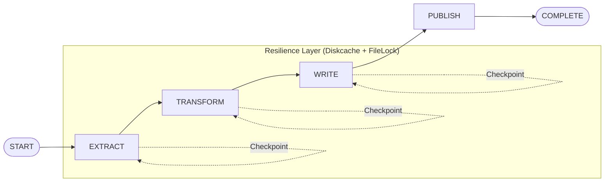

# Ingestion Engine

A highly resilient, distributed data ingestion framework designed for mission-critical ETL workflows. This service leverages modern data engineering patterns to ensure scalability, fault tolerance, and high-performance processing.

## Architecture & Core Design

The Ingestion Engine is built as a state-driven pipeline that moves data through a series of checkpoints. This design prioritizes observability and resilience, allowing for automatic recovery from any stage.

### Key Architectural Pillars

1. **Checkpoint-Driven State Machine**:
    - The workflow transitions through distinct states: `START -> EXTRACT -> TRANSFORM -> WRITE -> PUBLISH -> COMPLETE`.
    - Data is persisted as **Parquet** files at each stage, creating immutable checkpoints.
    - **Resilience**: If a stage fails, the orchestrator resumes from the last successful checkpoint, preventing redundant processing of upstream tasks.

2. **Distributed Compute with Ray**:
    - Leverages **Ray Actors** for parallel processing.
    - **IO/CPU Specialization**: Separate worker pools manage I/O-bound tasks (data acquisition, loading) and CPU-bound tasks (complex transformations, audits).
    - **Scalability**: The same codebase runs on a local machine during development and scales to a massive Kubernetes cluster in production without modifications.

3. **High-Performance Data Ops (Polars)**:
    - Powered by **Polars**, a lightning-fast Rust-based DataFrame library.
    - Maintains a strict **2GB RAM ceiling** even when processing datasets exceeding 50M rows using LazyFrame streaming.

4. **Autonomous Control Loop**:
    - A polling-based orchestrator ensures consistent behavior across different environments (EC2, K8s).
    - **Self-Healing**: Every "tick" of the control loop performs a full state reconciliation to recover from crashes or network partitions.

## 🔄 Workflow Lifecycle



## Resilience & Fault Tolerance

- **Circuit Breakers**: Implemented via a shared `ServiceRegistry` backed by **Diskcache**. This prevents cascading failures when external services (DBs, APIs) are down.
- **Atomic Handoffs**: Ray workers perform atomic updates to the job state, ensuring that half-finished tasks are never mistakenly marked as complete.
- **Zombie Task Recovery**: The orchestrator automatically detects stalled workers (via heartbeats) and re-queues them for retry.
- **Signal-Based Syncing**: Uses signal files (`.sync`, `.done`) for inter-process communication, ensuring portability across filesystems.
- **Filesystem as Source of Truth**: Metadata is managed in `active/` folders, allowing for recovery even if the central database is temporarily unavailable.

## Technology Stack

| Component         | Technology      | Why?                                                                    |
| :---              | :---            | :---                                                                    |
| Orchestration     | Ray             | Seamlessly distributed compute with IO/CPU specialized actor pools.     |
| Processing Engine | Polars          | Rust-level performance with LazyFrame streaming for low-RAM footprints. |
| Data Quality      | Pandera / Audit | Robust schema validation and contract enforcement.                      |
| Resilience        | Diskcache       | Persistent, cross-process state management for circuit breakers.        |
| Serialization     | msgspec         | Zero-copy JSON/YAML serialization for high-throughput metadata.         |
| Local Cloud       | LocalStack      | AWS-compatible S3 mocks for local-first development.                    |
| Observability     | ClickHouse      | High-performance OLAP store for execution logs and telemetry.           |

## Technical Deep Dive

### Hybrid Observability (JSONL + ClickHouse)

To minimize I/O overhead on workers while maintaining global visibility:

1. Local Buffering: Workers append state transitions to execution_stream.jsonl.
2. Scheduled Flushing: The Orchestrator rotates these files, converts them to Parquet, and performs bulk-inserts into ClickHouse (META.EXECUTION_LOG).
3. Query Layer: The "Active Registry" reflects the META.CURRENT_EXECUTION view for real-time status.

### Atomic State Consistency

The `manifest.json` acts as the single source of truth for every job. To guarantee consistency during hardware failures, we employ a Swap-and-Replace strategy:

1. Write updates to a .tmp file.
2. Call `os.fsync` to ensure bits are physically committed to the platter.
3. Perform an atomic `replace()` of the old manifest.

### Contract-Aware Ingestion

To handle production schema drift, the `RawStep` performs dynamic **Schema Unioning**. It scans the metadata footers of all partitioned Parquet files to identify column additions or type shifts, generating a master "Contract" for the downstream `TransformStep`. This prevents pipeline breaks when upstream APIs introduce new fields.

### Signal-Based IPC

We chose a filesystem-centric **Signal Architecture** (`.sync`, `.done`, `.cmd`) over traditional message brokers (RabbitMQ/Redis).

- **Portability**: Operates identically on local SSDs, AWS EFS, or Azure Files.
- **Observability**: Developers can "see" the state of the orchestrator by simply listing the `signals/` directory.
- **Backpressure**: The orchestrator's polling loop naturally batches signal processing, preventing "thundering herd" spikes during massive job fan-outs.

### Storage Virtualization

The service uses a dual-layered storage strategy:

- **Vault Layer (`data/`)**: Stores the physical, immutable Parquet checkpoints.
- **Active Layer (`active/`)**: Uses symlinks to point to the current data for easy job relocation.
Moving a job to `HOLD` or `FAILED` is a metadata-only operation (rewiring symlinks), which is near-instant regardless of whether the underlying data is 1MB or 1TB.

## Getting Started

### Prerequisites

- Python 3.11+
- Ray installed and configured (local or cluster)

### Usage

Trigger a manual ingestion job via the CLI:

```bash
python apps/ingestion/src/main.py ingest \
  --source "s3://my-data-bucket/sales_raw.csv" \
  --dataset "global_sales"
```

## 📈 Monitoring & Observability

Tasks can be monitored via the generated `manifest.json` in the `storage/active/{job_id}_{run_id}` directory. This manifest provides real-time insights into the current stage, status, and any error payloads.

1. **Filesystem**: Check the `signals/` and `active/` directories for real-time task movement.
2. **Ray Dashboard**: Visit `http://localhost:8265` to monitor worker resource utilization.
3. **ClickHouse**: Query `META.EXECUTION_LOG` for historical performance metrics.
4. **Logs**: Structured JSONL logs are available in `.workspace/logs/`.
