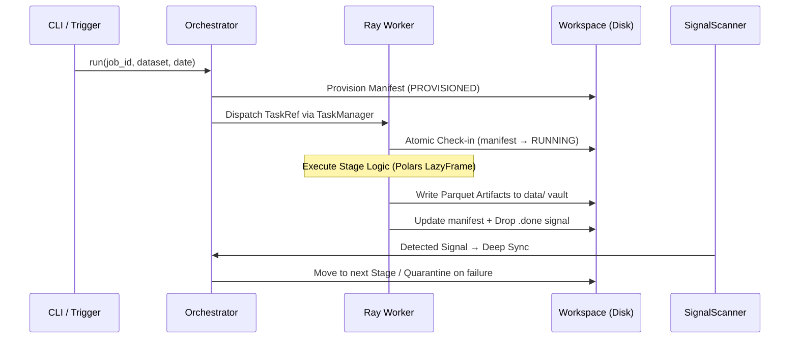

# Data-Ops Ingestion Engine

A high-performance, distributed ETL framework for scalable data processing with enterprise-grade resilience and observability. Built on Ray for distributed execution and Polars for lazy streaming transformations.

## 🚀 Engineering Highlights

* **Dual-Runtime Architecture:** Ships two operational modes — an **Always-On Daemon** (`start`) for continuous, schedule-driven ingestion and a **Trigger Runtime** (`run`) for ad-hoc or CI/CD use cases.
* **Resource-Aware Worker Scaling:** Dynamically calculates Ray worker counts using a "Width Factor" (column × row cell-budget of 20M cells/worker) to prevent OOMs before they occur.
* **Zero-Footprint Local Strategy:** The `Archive` stage reclaims high-speed local NVMe disk immediately after confirming S3 persistence, using relative symlinks to keep pipeline continuity.
* **Deterministic Data Vault:** A `data/{job}/{dataset}/{date}/{run_id}` vault structure ensures every run is immutable and reproducible across Kubernetes pods and worker nodes.
* **Self-Healing State Machine:** Filesystem signals (`.done`, `.fail`, `.blocked`), a Diskcache hot-cache, and the `Janitor` service combine to deliver crash-safe recovery without manual intervention.

---

## 🏗️ Technical Architecture

### Two Operational Modes

| Mode | Command | Use Case |
| :--- | :--- | :--- |
| **Daemon** | `python -m ingestion start` | Always-on, DB-scheduled, enterprise orchestration |
| **Trigger** | `python -m ingestion run` | Ad-hoc runs, CI/CD pipelines, manual backfills |

### Step-Based Pipeline

Each dataset defines an explicit `steps` sequence in its `config.yaml`. Each step calls one of the available stages — there is no fixed pipeline order. This allows datasets to compose only the stages they need:

```yaml
# config/jobs/my_job/config.yaml
datasets:
  orders:
    steps:
      - id: extract_orders
        call: extract       # available: extract | transform | write | publish | archive
        with:
          object: orders.csv
      - id: normalize_orders
        call: transform
        inputs:
          raw: "{steps.extract_orders.artifact_folder}"
      - call: write
      - call: publish
```

Step outputs are referenced by name via `{steps.<id>.<field>}`, binding the data dependency graph explicitly. Execution can be scoped to a sub-range using `--from` / `--to` flags.

### Deterministic Lifecycle



---

## 🛡️ Resilience & Reliability

### Four Pillars of State

State is synchronized across four layers to ensure 100% observability:

1. **Physical Layer (`active/`)** — source of truth: `manifest.json` + `config.json`
2. **Hot Cache (Diskcache/SQLite)** — sub-millisecond scheduling decisions in the Orchestrator
3. **Event Bus (`signals/`)** — zero-byte files (`.done`, `.fail`, `.blocked`, `.cmd`) for async IPC
4. **Telemetry Tier (ClickHouse)** — persistent SQL audit logs via `META.EXECUTION_LOG`

### Self-Healing Mechanisms

| Failure Mode | Detection | Automated Action |
| :--- | :--- | :--- |
| **Zombie Tasks** | `MaintenancePolicy` compares `RUNNING` cache against Ray GCS | Re-queued automatically after >5 min heartbeat drift |
| **Service Outage** | `ServiceMonitor` trips global circuit breaker after 3 failures | Tasks moved to `HOLD/`; Daemon auto-resumes on recovery |
| **Transient Retries** | `Executor` catches retriable exceptions | Exponential backoff (2^n x 30s, max 10 min); Midnight Kill policy |
| **Task Expiry** | `ExpiredState` checks `EXPIRATION_THRESHOLD` in DB | Purged by Janitor; extract-complete tasks **protected** |

---

## 🛠️ Technology Stack

| Layer | Tech | Why? |
| :--- | :--- | :--- |
| **Compute** | Ray | Process isolation and horizontal scaling without GIL |
| **Data Engine** | Polars | Rust-level performance with `LazyFrame` streaming |
| **Resilience** | Diskcache | Zero-latency, atomic state sharing across Ray workers |
| **Serialization** | msgspec | Near-zero overhead for manifest & config marshalling |
| **Telemetry** | ClickHouse | High-throughput OLAP store for historical run metrics |
| **CLI** | Typer | Self-documenting, type-safe command interfaces |

---

## 🏁 Usage

### Global Flags

These flags apply to all commands:

```bash
python -m ingestion [--dry-run] [--verbose/-v] [--ray_mode local|cluster] <command>
```

### Start the Always-On Daemon

```bash
python -m ingestion start
```

Launches the `DaemonRuntime` which polls the metadata database for scheduled runs and reacts to filesystem `.cmd` signals.

### Trigger a Pipeline Run

```bash
python -m ingestion run 2024-05-20 --job-id sales_sync --dataset daily_orders
```

Run a specific date/dataset to completion and exit. Supports stage scoping:

```bash
# Run only the extract and transform stages
python -m ingestion run 2024-05-20 --job-id sales_sync --dataset daily_orders --from extract --to transform

# Override a config parameter at runtime
python -m ingestion run 2024-05-20 --job-id sales_sync --dataset daily_orders --set batch_size=5000
```

### Queue an Ad-Hoc Run (for Daemon)

```bash
python -m ingestion add 2024-05-20 --job-id sales_sync --dataset daily_orders
```

Drops a `.cmd` signal file for the active Daemon to pick up. Does not block.

### Resume a Failed Run

```bash
# Resume from the point of failure
python -m ingestion resume {run_id}

# Force a rewind to a specific stage
python -m ingestion resume {run_id} --from extract

# Apply config overrides during recovery
python -m ingestion resume {run_id} --set timeout=600
```

In Daemon mode, this drops a `RESUME_{run_id}.cmd` signal. In Trigger mode, it executes the recovery immediately.

### Stop the Daemon

```bash
# Graceful drain (waits for active tasks to finish)
python -m ingestion stop

# Force kill (immediate shutdown)
python -m ingestion stop --force
```

### Clean the Workspace

```bash
# Purge expired tasks (default: TTL-based)
python -m ingestion clean

# Purge a specific run
python -m ingestion clean {run_id}

# Purge all tasks older than 7 days
python -m ingestion clean --days 7

# Wipe the entire workspace (requires confirmation; blocked if daemon is running)
python -m ingestion clean --all
```

---

## 🩺 Diagnostics (`doctor`)

```bash
# Run all health checks
python -m ingestion doctor

# Check filesystem health and disk space
python -m ingestion doctor fs

# Deep network path diagnostic (VPN, DNS, proxies, firewalls)
python -m ingestion doctor network check s3.amazonaws.com 443 --proxy http://cntlm:3128

# Visualize network hops to a host
python -m ingestion doctor network trace clickhouse.prod

# Test connectivity for a configured service type
python -m ingestion doctor connect oracle_db --env prod

# Validate config YAML syntax and schema
python -m ingestion doctor config --job-id sales_sync
python -m ingestion doctor config --all

# Show the fully merged configuration for a job/dataset
python -m ingestion doctor inspect sales_sync --dataset daily_orders
```

---

## 🔬 Testing & Validation (`test`)

### Inspect Parquet Data

```bash
# Preview first 10 rows
python -m ingestion test peek .workspace/active/{run_id}/extract/

# Run inline SQL against the file
python -m ingestion test peek .workspace/FAILED/{run_id}/extract/ --sql "SELECT count(*) FROM self"

# Show schema only
python -m ingestion test peek path/to/data.parquet --schema
```

### Regression Testing

Compare a Candidate build against a stable Baseline to detect record drift:

```bash
python -m ingestion test regression run 2024-05-20 --job-id core_finance --dataset ledger

# Skip baseline regeneration if tables already exist
python -m ingestion test regression run 2024-05-20 --job-id core_finance --dataset ledger --reuse-baseline

# Find peer datasets sharing the same transform logic (impact analysis)
python -m ingestion test regression impact core_finance ledger
```

### Chaos / Resilience Scenarios

```bash
# Run a single resilience scenario
python -m ingestion test scenario zombie --job-id sales_sync --dataset daily_orders

# Run the full resilience batch suite
python -m ingestion test scenario --yes
```

Available scenarios: `concurrency`, `memory`, `zombie`, `recovery`, `block`, `stress`, `schema_drift`, `data_loss`, `retention`, `kill_daemon`, `latency`, `disk_full`.

### Validate Configuration Files

```bash
python -m ingestion test config path/to/config.yaml
```

---

## 📈 Monitoring & Diagnostics

| Surface | Details |
| :--- | :--- |
| **Filesystem** | `ls .workspace/signals/` — real-time task events |
| **Manifest** | `.workspace/active/{identity}/{run_id}/manifest.json` — live stage progress |
| **Ray Dashboard** | `http://localhost:8265` — worker resource utilization |
| **ClickHouse** | `SELECT * FROM META.EXECUTION_LOG` — historical performance metrics |
| **Logs** | `.workspace/logs/{job_id}.jsonl` — structured JSON run logs |

---

## 🛠️ Handling Failures

1. **Inspect the Manifest:**
   ```bash
   python -m ingestion test peek .workspace/FAILED/{run_id}/manifest.json
   ```
2. **Check External Connectivity:**
   ```bash
   python -m ingestion doctor connect {service_name}
   ```
3. **Inspect Data at Point of Failure:**
   ```bash
   python -m ingestion test peek .workspace/FAILED/{run_id}/extract/ --sql "SELECT count(*) FROM self"
   ```
4. **Resume from the Point of Failure:**
   ```bash
   python -m ingestion resume {run_id}
   ```

---

## 🏁 Getting Started

### Prerequisites

* Python 3.11+ (managed via `uv`)
* Ray cluster (local or distributed)
* ClickHouse (for state telemetry and scheduling)

### Setup

```bash
uv run python -m ingestion doctor   # Verify environment health
```

---

## 📖 Further Reading

| Document | Description |
| :--- | :--- |
| [`docs/architecture.md`](docs/architecture.md) | Architectural Decision Records (ADRs 001–013) |
| [`docs/component_graph.md`](docs/component_graph.md) | Mermaid component graphs for Daemon and Trigger modes |
| [`docs/task_lifecycle.md`](docs/task_lifecycle.md) | Deep dive: provisioning → execution → telemetry |
| [`docs/resilience_playbook.md`](docs/resilience_playbook.md) | Incident response and self-healing configuration |
| [`docs/configuration_guide.md`](docs/configuration_guide.md) | Job YAML schema and validation rules |
