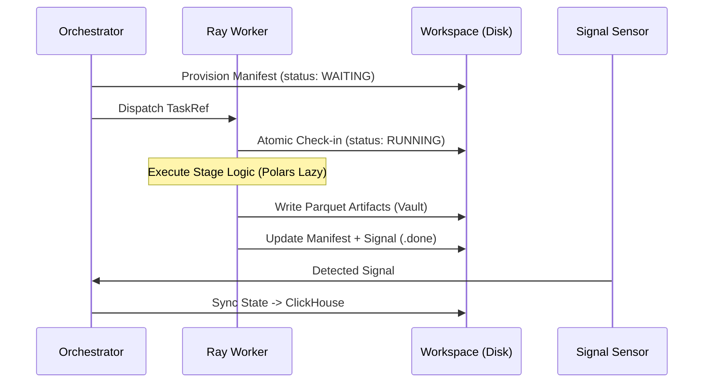

# Data-Ops Ingestion Engine

A high-performance, distributed ETL framework designed for scalable data processing with a focus on memory efficiency. This engine utilizes Ray for orchestration and Polars for lazy streaming transformations, ensuring enterprise-grade resilience and observability.

## 🚀 Engineering Highlights

* **Resource-Aware Worker Scaling:** Dynamically calculates the number of Ray workers based on "Width Factors" (column count vs. row count) to prevent OOMs before they happen.
* **Zero-Footprint Local Strategy:** Reclaims high-speed local disk space immediately after archiving data to S3, using relative symlinks to maintain pipeline integrity.
* **Deterministic Workspace:** Implements a "Data Vault" pattern (`data/stage/run/`) ensuring that every run is immutable and reproducible.
* **Self-Healing State Machine:** Uses bitmask-driven checkpoints and filesystem signals (`.done`, `.fail`) for "Fail-Fast" recovery that survives orchestrator crashes.

## 🏗️ Technical Architecture

### Distributed Control Plane (Ray)

The engine separates I/O-bound workers (Extraction/Loading) from CPU-bound workers (Transformation) using custom Ray Resource Maps. This prevents "Thundering Herd" scenarios where network ingestion starves CPU-intensive schema merges.

### Deterministic Lifecycle



## 🛡️ Resilience & Reliability

* **Circuit Breakers:** Uses a cross-process `Diskcache` registry to trip connectivity to unstable sources (Oracle, APIs) globally across the Ray cluster.
* **Zombie Detection:** The `Janitor` service reconciles the "Active Registry" against Ray's internal state, automatically re-queuing tasks whose workers died silently.
* **Contract-Aware Ingestion:** Performs dynamic **Schema Unioning** across distributed Parquet files to handle upstream API drift without breaking the downstream `Transform` logic.

## 🛠️ Technology Stack

| Layer | Tech | Why? |
| :--- | :--- | :--- |
| **Compute** | Ray | Seamless process isolation and horizontal scaling. |
| **Engine** | Polars | Rust-level performance with `LazyFrame` streaming. |
| **Resilience** | Diskcache | Zero-latency, atomic state sharing across nodes. |
| **Serialization** | msgspec | JSON/YAML overhead reduced to near-zero for metadata. |
| **Observability** | ClickHouse | High-performance OLAP store for historical telemetry. |

## 🔬 Technical Deep Dives

### Adaptive Throttling

The `Compute` manager monitors system vitals (CPU/MEM/Disk). If disk usage exceeds thresholds, the orchestrator gracefully stops spawning new workers while allowing `Load` stages to complete, effectively clearing the local backlog before a hard crash occurs.

### The "Data Vault" Pattern

To ensure portability across Kubernetes pods, the engine uses relative symlinks in the `active/` folder. A `Transform` stage simply reads from `../extract/`, which the engine ensures points to the deterministic physical artifacts in the vault, regardless of the worker node's absolute path.

## 🏁 Usage

### Running a Pipeline

```bash
python -m ingestion run 2024-05-20 --job-id sales_sync --dataset daily_orders
```

### Environment Diagnostics

```bash
python -m ingestion doctor network s3.amazonaws.com 443 --proxy http://cntlm:3128
```

### Regression Testing

Compare a "Candidate" PEX against a "Baseline" version to detect record drift:

```bash
python -m ingestion test regression run --job-id core_finance --dataset ledger
```

### Signal-Based IPC

We chose a filesystem-centric **Signal Architecture** (`.sync`, `.done`, `.cmd`) over traditional message brokers (RabbitMQ/Redis).

* **Portability**: Operates identically on local SSDs, AWS EFS, or Azure Files.
* **Observability**: Developers can "see" the state of the orchestrator by simply listing the `signals/` directory.
* **Backpressure**: The orchestrator's polling loop naturally batches signal processing, preventing "thundering herd" spikes during massive job fan-outs.

### Storage Virtualization

The service uses a dual-layered storage strategy:

* **Vault Layer (`data/`)**: Stores the physical, immutable Parquet checkpoints.
* **Active Layer (`active/`)**: Uses symlinks to point to the current data for easy job relocation.
Moving a job to `FAILED` is a metadata-only operation (rewiring symlinks), which is near-instant regardless of whether the underlying data is 1MB or 1TB.

## Getting Started

### Prerequisites

* Python 3.11+ (`uv` recommended)
* Ray cluster (Local or Distributed)
* ClickHouse (for state telemetry)

### Usage

The toolkit is executed as a module. Trigger a manual ingestion job via the `run` command:

```bash
python -m ingestion run 2024-05-20 --job-id sales_sync --dataset daily_orders
```

## 📈 Monitoring & Diagnostics

Tasks can be monitored via the generated `manifest.json` in the `.workspace/active/{job_id}:{dataset_id}_{date}/{run_id}` directory. This manifest provides real-time insights into the current stage, status, and any error payloads.

1. **Filesystem**: Check the `.workspace/signals/` and `.workspace/active/` directories for real-time task movement.
2. **Ray Dashboard**: Visit `http://localhost:8265` to monitor worker resource utilization.
3. **ClickHouse**: Query `META.EXECUTION_LOG` for historical performance metrics.
4. **Diagnostics**: Run `python -m ingestion doctor` to verify environment health.

## 🛠️ Operational Guide: Handling Failures

This engine is designed to handle failure gracefully. If a job moves to the `FAILED/` directory:

1. **Inspect the Manifest:** Open `.workspace/FAILED/{run_id}/manifest.json`. The `error` block contains the stage, message, and a full traceback.
2. **Check the Doctor:** Run `python -m ingestion doctor connect {host} {port}` to see if an external dependency is unreachable.
3. **Review the Vault:** Use `python -m ingestion test peek {path}` to inspect the physical data artifacts in the vault and verify quality at the point of failure.
4. **Resume:** After fixing the issue (e.g., updating a credential), run `python -m ingestion resume --run-id {id}` to restart the task from the exact point of failure.

## 📖 Developer Guide: Adding a Transformer

To add custom business logic, simply create a new class in `libs/strategies/transform/` that inherits from `BaseTransformer` and register it in the `TransformFactory`. The engine will automatically handle the distributed batching and memory management via Ray.
