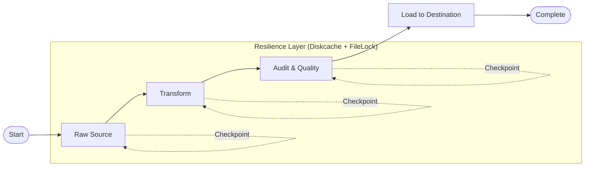

# Ingestion Engine

A highly resilient, distributed data ingestion framework designed for mission-critical ETL workflows. This service leverages modern data engineering patterns to ensure scalability, fault tolerance, and high-performance processing.

## 🏗️ Architecture & Core Design

The Ingestion Engine is built as a state-driven pipeline that moves data through a series of checkpoints. This design prioritizes observability and resilience, allowing for automatic recovery from any stage.

### Key Architectural Pillars

1.  **Checkpoint-Driven State Machine**: 
    -   The workflow transitions through distinct states: `Start -> Raw -> Transform -> Audit -> Load -> Complete`.
    -   Data is persisted as **Parquet** files at each stage, creating immutable checkpoints.
    -   **Resilience**: If a step fails, the orchestrator resumes from the last successful checkpoint, preventing redundant processing of upstream tasks.

2.  **Distributed Compute with Ray**:
    -   Leverages **Ray Actors** for parallel processing.
    -   **IO/CPU Specialization**: Separate worker pools manage I/O-bound tasks (data acquisition, loading) and CPU-bound tasks (complex transformations, audits).
    -   **Scalability**: The same codebase runs on a local machine during development and scales to a massive Kubernetes cluster in production without modifications.

3.  **High-Performance Data Ops (Polars)**:
    -   Powered by **Polars**, a lightning-fast Rust-based DataFrame library.
    -   Significantly reduces memory overhead and processing time compared to traditional Python-based alternatives.

4.  **Autonomous Control Loop**:
    -   A polling-based orchestrator ensures consistent behavior across different environments (EC2, K8s).
    -   **Self-Healing**: Every "tick" of the control loop performs a full state reconciliation to recover from crashes or network partitions.

## 🔄 Workflow Lifecycle



## 🛡️ Resilience & Fault Tolerance

-   **Circuit Breakers**: Implemented via a shared `ServiceRegistry` backed by **Diskcache**. This prevents cascading failures when external services (DBs, APIs) are down.
-   **Atomic Handoffs**: Ray workers perform atomic updates to the job state, ensuring that half-finished tasks are never mistakenly marked as complete.
-   **Zombie Job Recovery**: The orchestrator automatically detects stalled workers (via heartbeats) and re-queues them for retry.
-   **Signal-Based Syncing**: Uses signal files (`.sync`, `.done`) for inter-process communication, ensuring portability across filesystems.

## 🛠️ Technology Stack

| Component | Technology | Why? |
| :--- | :--- | :--- |
| **Orchestration** | Ray | Seamlessly distributed compute with IO/CPU specialized actor pools. |
| **Processing Engine** | Polars | Rust-level performance with LazyFrame streaming for low-RAM footprints. |
| **Data Quality** | Pandera | Robust schema validation and contract enforcement. |
| **Resilience** | Diskcache | Persistent, cross-process state management for circuit breakers. |
| **Serialization** | Msgspec | Zero-copy JSON/Msgpack serialization for high-throughput IPC. |

## 🧠 Technical Deep Dive

### 🌊 Streaming ETL Design
The engine utilizes **Polars LazyFrames** to process datasets exceeding 50M rows while maintaining a strict **2GB RAM ceiling**. Instead of eager loading, we build a logical execution plan that the Polars Rust engine streams through partitioned sinks. This ensures that memory consumption remains proportional to the buffer size, not the total dataset size.

### 📜 Contract-Aware Ingestion
To handle production schema drift, the `RawStep` performs dynamic **Schema Unioning**. It scans the metadata footers of all partitioned Parquet files to identify column additions or type shifts, generating a master "Contract" for the downstream `TransformStep`. This prevents pipeline breaks when upstream APIs introduce new fields.

### 📡 Signal-Based IPC
We chose a filesystem-centric **Signal Architecture** (`.sync`, `.done`, `.cmd`) over traditional message brokers (RabbitMQ/Redis). 
- **Portability**: Operates identically on local SSDs, AWS EFS, or Azure Files.
- **Observability**: Developers can "see" the state of the orchestrator by simply listing the `signals/` directory.
- **Backpressure**: The orchestrator's polling loop naturally batches signal processing, preventing "thundering herd" spikes during massive job fan-outs.

### 💾 Atomic State Consistency
The `manifest.json` acts as the single source of truth for every job. To guarantee consistency during hardware failures, we employ a **Swap-and-Replace** strategy:
1. Write updates to a `.tmp` file.
2. Call `os.fsync` to ensure bits are physically committed to the platter.
3. Perform an atomic `replace()` of the old manifest.

### 📂 Storage Virtualization
The service uses a dual-layered storage strategy:
- **Vault Layer (`data/`)**: Stores the physical, immutable Parquet checkpoints.
- **Active Layer (`active/`)**: Uses symlinks to point to the current data for easy job relocation. 
Moving a job to `HOLD` or `FAILED` is a metadata-only operation (rewiring symlinks), which is near-instant regardless of whether the underlying data is 1MB or 1TB.

## 🚀 Getting Started

### Prerequisites

- Python 3.11+
- Ray installed and configured (local or cluster)

### Usage

Trigger a manual ingestion job via the CLI:

```bash
python apps/ingestion/src/main.py ingest \
  --source "s3://my-data-bucket/sales_raw.csv" \
  --dataset "global_sales"
```

## 📈 Monitoring & Observability

Jobs can be monitored via the generated `manifest.json` in the `storage/active/{job_id}_{run_id}` directory. This manifest provides real-time insights into the current step, status, and any error payloads.
