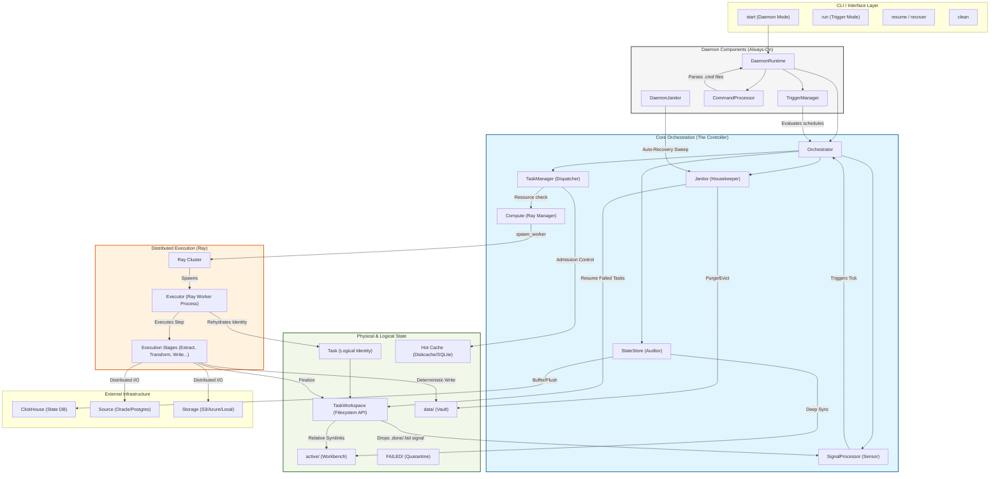
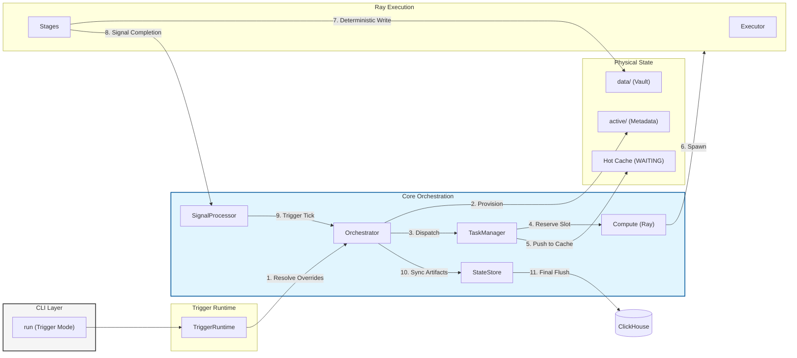

# Component Graph
## Daemon Mode

```mermaid
graph TB
    subgraph CLI ["CLI / Interface Layer"]
        C_START["start (Daemon Mode)"]
        C_RUN["run (Trigger Mode)"]
        C_RESUME["resume / recover"]
        C_CLEAN["clean"]
    end

    subgraph DAEMON ["Daemon Components (Always-On)"]
        RT["DaemonRuntime"]
        TRIG["TriggerManager"]
        CMD["CommandProcessor"]
        DJAN["DaemonJanitor"]
    end

    subgraph CORE ["Core Orchestration (The Controller)"]
        ORCH["Orchestrator"]
        TMGR["TaskManager (Dispatcher)"]
        SIG["SignalProcessor (Sensor)"]
        SSTORE["StateStore (Auditor)"]
        COMP["Compute (Ray Manager)"]
        JAN["Janitor (Housekeeper)"]
    end

    subgraph STATE ["Physical & Logical State"]
        TASK["Task (Logical Identity)"]
        WS["TaskWorkspace (Filesystem API)"]
        CACHE["Hot Cache (Diskcache/SQLite)"]
        FS_ACTIVE["active/ (Workbench)"]
        FS_DATA["data/ (Vault)"]
        FS_FAILED["FAILED/ (Quarantine)"]
    end

    subgraph WORKER ["Distributed Execution (Ray)"]
        RAY["Ray Cluster"]
        EXEC["Executor (Ray Worker Process)"]
        STAGES["Execution Stages (Extract, Transform, Write...)"]
    end

    subgraph INFRA ["External Infrastructure"]
        CH["ClickHouse (State DB)"]
        DB_SRC["Source (Oracle/Postgres)"]
        S3_OBJ["Storage (S3/Azure/Local)"]
    end

    %% Daemon Loop Interactions
    C_START --> RT
    RT --> TRIG
    RT --> CMD
    RT --> ORCH

    TRIG -- Evaluates schedules --> ORCH
    CMD -- Parses .cmd files --> RT

    %% Orchestrator Coordination
    ORCH --> TMGR
    ORCH --> SIG
    ORCH --> SSTORE
    ORCH --> JAN

    %% Dispatching Flow
    TMGR -- Admission Control --> CACHE
    TMGR -- Resource check --> COMP
    COMP -- spawn_worker --> RAY
    RAY -- Spawns --> EXEC

    %% Worker Execution Flow
    EXEC -- Rehydrates Identity --> TASK
    TASK --> WS
    EXEC -- Executes Step --> STAGES
    STAGES -- Distributed I/O --> DB_SRC
    STAGES -- Distributed I/O --> S3_OBJ
    STAGES -- Deterministic Write --> FS_DATA

    %% Event Feedback Loop
    STAGES -- Finalize --> WS
    WS -- Drops .done/.fail signal --> SIG
    WS -- Relative Symlinks --> FS_ACTIVE
    SIG -- Triggers Tick --> ORCH

    %% Auditing & Maintenance
    SSTORE -- Deep Sync --> FS_ACTIVE
    SSTORE -- Buffer/Flush --> CH
    JAN -- Resume Failed Tasks  --> WS
    JAN -- Purge/Evict --> FS_DATA
    DJAN -- Auto-Recovery Sweep --> JAN

    %% Styling
    style DAEMON fill:#f5f5f5,stroke:#333,stroke-width:2px
    style CORE fill:#e1f5fe,stroke:#01579b,stroke-width:2px
    style WORKER fill:#fff3e0,stroke:#e65100,stroke-width:2px
    style STATE fill:#f1f8e9,stroke:#1b5e20,stroke-width:2px
```

## Trigger Mode (Ad-hoc / CI-CD)

```mermaid
graph LR
    subgraph CLI ["CLI Layer"]
        C_RUN["run (Trigger Mode)"]
    end

    subgraph RUNTIME ["Trigger Runtime"]
        TR["TriggerRuntime"]
    end

    subgraph CORE ["Core Orchestration"]
        ORCH["Orchestrator"]
        TMGR["TaskManager"]
        COMP["Compute (Ray)"]
        SIG["SignalProcessor"]
        SSTORE["StateStore"]
    end

    subgraph STATE ["Physical State"]
        CACHE["Hot Cache (WAITING)"]
        FS_ACTIVE["active/ (Metadata)"]
        FS_DATA["data/ (Vault)"]
    end

    subgraph WORKER ["Ray Execution"]
        EXEC["Executor"]
        STG["Stages"]
    end

    %% Execution Flow
    C_RUN --> TR
    TR -- 1. Resolve Overrides --> ORCH
    ORCH -- 2. Provision --> FS_ACTIVE
    ORCH -- 3. Dispatch --> TMGR

    TMGR -- 4. Reserve Slot --> COMP
    TMGR -- 5. Push to Cache --> CACHE
    COMP -- 6. Spawn --> WORKER

    STG -- 7. Deterministic Write --> FS_DATA
    STG -- 8. Signal Completion --> SIG

    SIG -- 9. Trigger Tick --> ORCH
    ORCH -- 10. Sync Artifacts --> SSTORE
    SSTORE -- 11. Final Flush --> CH[(ClickHouse)]

    %% Styling
    style CLI fill:#f5f5f5,stroke:#333,stroke-width:2px
    style CORE fill:#e1f5fe,stroke:#01579b,stroke-width:2px
```
