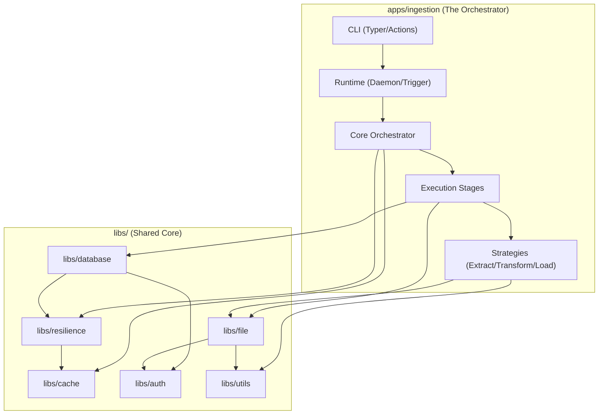
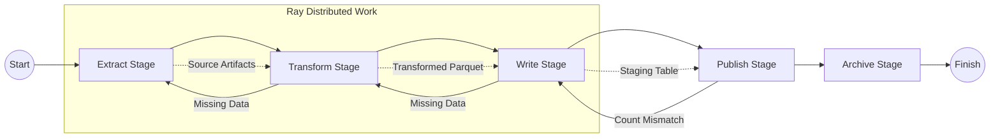

# Dependency Graph

This document illustrates the structural dependencies between modules and the logical execution flow of the ingestion pipeline.

## 1. Module-Level Hierarchy
This graph shows how the `ingestion` app consumes the shared `libs/` layer and how internal components are coupled.

## 2. Execution Stage Dependencies (The Pipeline)
This graph represents the state-machine transitions and physical data dependencies. A failure in an upstream stage typically triggers a `RewindTask` or quarantine logic.

## Summary of Coupling

- **Loose Coupling (Services)**: The stages depend on `ServiceFactory`, not concrete implementations like `ClickHouseService`. This allows the engine to support new databases without modifying the orchestrator core.
- **Strong Coupling (State)**: All components are strongly coupled to the `ExecutionContext` and `TaskManifest`. This ensures a single source of truth for the "Physical State" on disk.