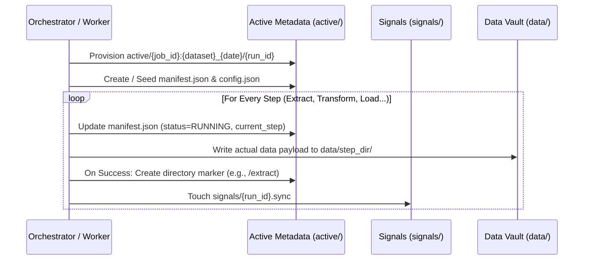

# Job Lifecycle Folder Structure & Process

This document outlines the folder-based state management that powers the job lifecycle inside the ingestion orchestrator. The pipeline uses the file system as a definitive source of truth to manage running jobs, recover from crashes, and signal progress.

## Global Workspace Structure

The core ingestion engine relies on a standardized `workspace_dir` (configured by the `ExecutionContext`), which acts as the root for all state and data payload storage.

```text
workspace_dir/
├── active/        # In-flight jobs and their single-source-of-truth metadata.
├── data/          # Persistent/physical data vaults for staging data between steps.
├── signals/       # Zero-byte files acting as event notifications.
├── HOLD/          # Jobs intentionally paused (e.g., waiting for external locks).
└── FAILED/        # Jobs that have crashed and await manual intervention or automatic retries.
```

---

## 1. Job Initialization

When a new ingestion job is triggered, the engine provisions a dedicated isolated space for its metadata in the `active/` directory. 

**Folder Path:**
`active/{job_id}:{dataset_id}_{run_date}/{run_id}/`

**Initial Files Created:**
1. `manifest.json`: Single source of truth tracking the current state, step, and status. It is atomically updated throughout the job.
2. `*_config.json`: The specific runtime configuration for the job is moved from the active root into this dedicated run folder.

---

## 2. Execution and State Transitions

Jobs progress sequentially through an expected order of steps (e.g., `START` → `EXTRACT` → `TRANSFORM` → `LOAD` → `AUDIT` → `COMPLETE`).

During each step execution:
1. **Check-In (`job.check_in`):** The orchestrator atomically overwrites `manifest.json` setting `status: "RUNNING"` and the `current_step`.
2. **Data Storage:** Data processing produces physical files. These large files are strictly stored in the `data/` vault to keep the metadata directories lightweight.
   **Data Folder Naming Convention:**
   `data/{step_name}/{job_id}_{unix_timestamp}/`
   *Example:* `data/extract/my_job_1710990200/` or `data/transform/my_job_1710990250/`
3. **Completion Marker:** As soon as a step cleanly finishes, the system creates a symlink or subdirectory marker in the active folder named identically to the step (e.g. `active/.../{run_id}/extract`) pointing to the physical data vault. The Engine checks for the existence of this localized marker when recovering from orchestrator crashes to guarantee a step formally reached the finish line.
4. **Signals:** The job drops zero-byte files inside `signals/{run_id}.sync` or `{run_id}.done` to loosely ping observers about the state change.



---

## 3. Terminal Transitions

When the continuous forward progression breaks or ceases, the job folder relocates or is destroyed.

### Interruption (Hold and Failure)

If a step results in an unhandled exception or encounters an intentional barrier (e.g., hitting rate limits, locked dependency), the active job folder is physically relocated into a corresponding root:

* **HOLD:** `HOLD/{job_id}/{run_id}/`
* **FAILED:** `FAILED/{job_id}/{run_id}/`

*Notice the hierarchy simplifies since we no longer rely on `{dataset}_{date}` composite keys in the terminal hierarchies.*

The orchestrator’s `LifecycleManager` will occasionally run a "sweep" routine across the `HOLD/` and `FAILED/` directories. If a stopped job's state allows it to resume, the orchestrator pulls its `manifest.json`, reconstructs the state context, and re-queues it back into the Active structure.

### Expiry and Garbage Collection

If a job reaches `COMPLETE`, or has stagnated beyond its TTL (Time-To-Live), the `LifecycleManager` triggers physical cleanup:
1. The `active` folder tree for the `run_id` is permanently deleted.
2. The orchestrator walks the `data/` trees looking for files prefixed with `{job_id}_*` and purges those corresponding raw payloads.

## 4. End of Lifecycle: The `CompleteStep`

Assuming a job runs successfully through the entire pipeline and finishes its final step (`CompleteStep`), the system reaches a "Zero-Footprint" (or minimized footprint) state for that run. 

**What you will see on disk immediately after `CompleteStep`:**

```text
workspace_dir/
├── active/
│   └── {job_id}:{dataset_id}_{run_date}/
│       └── {run_id}/
│           ├── manifest.json       (status=COMPLETED)
│           └── {job_id}_{run_id}_config.json
├── data/                           (Intermediate extract/transform data purged)
├── signals/
│   └── {run_id}.done               (Deep-sync completion signal)
└── archive_base_path/              (If archival is enabled)
    └── {job_id}/
        └── {run_id}/
            ├── extract/            (Persisted raw data)
            └── transform/          (Persisted transformed data)
```

1. **The Active Folder remains:** `active/{job_id}:{dataset_id}_{run_date}/{run_id}/` is kept alive until it naturally expires (TTL) or is swept by the Janitor.
2. **Inside the Active Folder:** You will still see the `manifest.json` (with its status as `COMPLETED`/`FINISH`) and the `config.json`.
3. **Cleaned Intermediate Data:** The `extract` and `transform` physical data directories (and their symlinks) are intentionally purged from the local high-speed disk to reclaim space.
4. **Archived Data:** If archiving was enabled in the job context, the data that was in `data/extract` and `data/transform` is safely moved to the long-term object store (e.g., S3 or a local archive path).
5. **Final Signal:** A heavy sync signal is dropped at `signals/{run_id}.done` to notify observers that the job has completely finished.

---

## Complete Lifecycle Flow

```mermaid
graph TD
    Trigger((Job Triggered)) --> Provision[Create active/ folder & manifests]
    
    subgraph Execution Loop
        Provision --> CheckIn[Check-in manifest.json]
        CheckIn --> Process[Process Payload into data/]
        Process --> SuccessMark[Create Step Success Marker]
        SuccessMark --> Process
    end
    
    Process -- "Crash / Error" --> F[Move to FAILED/{run_id}]
    Process -- "Wait for Resource" --> H[Move to HOLD/{run_id}]
    SuccessMark -- "Final Step (Complete)" --> C(Job Complete)
    
    F -- "Manual/Auto Retry" --> CheckIn
    H -- "Resource Freed" --> CheckIn
    
    C --> Cleanup[Janitor: Purge Active Metadata & physical data/]
    F -- "TTL Expired" --> Cleanup
    H -- "TTL Expired" --> Cleanup
```
